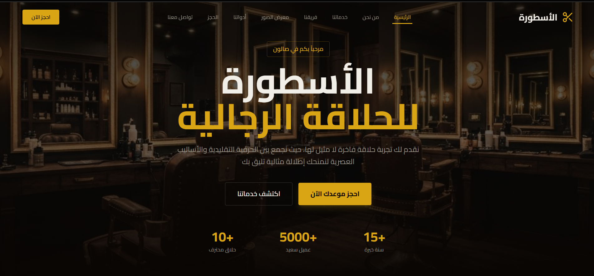

<div align="center">
  
  # Al-Ostoura Barber Shop 💈
  **Premium Men's Grooming & Barber Shop Website**

  <!-- Badges -->
  [](https://nextjs.org/)
  [](https://react.dev/)
  [](https://tailwindcss.com/)
  [](https://www.typescriptlang.org/)
  [](https://opensource.org/licenses/MIT)
  [](https://vercel.com)
</div>

---

## 📖 About The Project

**Al-Ostoura Barber Shop** is a modern, high-performance, responsive web application tailored for a premium men's grooming salon. Designed with an **RTL (Right-to-Left)** layout to natively support Arabic, it offers an elegant user interface powered by **Tailwind CSS v4**, **Radix UI**, and **Framer Motion** for smooth, professional micro-interactions. The website provides clients with everything they need: exploring services, meeting the team, checking the gallery, finding the location, and booking appointments seamlessly via direct WhatsApp integration.

---

## ✨ Key Features

- **🌐 RTL Optimized:** Deeply integrated Arabic language support using the elegant Cairo font.
- **🎨 Premium UI/UX:** Stunning luxury aesthetic design built with the latest Tailwind CSS and Radix UI primitives.
- **✨ Smooth Animations:** High-end micro-interactions and on-scroll reveal animations powered by Framer Motion.
- **📱 Fully Responsive:** Flawless browsing experience across all screen sizes (Desktop, Tablet, Mobile).
- **📅 Booking System:** Dedicated booking forms seamlessly interacting with WhatsApp for direct customer reservations.
- **⚡ Performance First:** Built utilizing Next.js App Router for blazing-fast speed and SEO, plus optimized images and Vercel Analytics tracking.
- **🌗 Theming Capability:** Dynamic setup for seamless dark/light mode configurations.

---

## 🛠 Prerequisites

Before you begin, ensure you have the following installed on your local machine:
- **Node.js** (v18.17.0 or newer recommended)
- **npm** (v9 or newer) / **yarn** / **pnpm** / **bun**
- **Git**

---

## 🚀 Installation & Running Locally

Follow these precise steps to get your development environment running locally:

1. **Clone the repository:**
   ```bash
   git clone https://github.com/your-username/baber-shop.git
   cd "Baber Shop"
   ```

2. **Install all required dependencies:**
   ```bash
   npm install
   # or
   yarn install
   # or
   pnpm install
   ```

3. **Start the Next.js development server:**
   ```bash
   npm run dev
   # or
   yarn dev
   ```

4. **Open the application:**
   Navigate to [http://localhost:3000](http://localhost:3000) in your favorite browser.

---

## 💡 Usage & Customization

The highly modular Next.js architecture makes it incredibly easy to customize content or scale the application. All main feature sections reside inside the `components/` directory.

### Adding or Modifying a Service
To add a new service to the pricing list, navigate to `components/services-section.tsx` and modify the services data array.

```tsx
// Example of adding a new service object
const services = [
  // ... existing services
  {
    id: 'deep-facial',
    title: 'تنظيف بشرة عميق', // Deep Facial Cleansing
    description: 'تنظيف وتفتيح البشرة مع سنفرة وبخار.', 
    price: '150 EGP',
    icon: <Sparkles className="w-6 h-6 text-primary" />
  }
];
```

### Updating Business Hours
Navigate to `components/hours-section.tsx` to seamlessly adjust your salon's working hours:

```tsx
const workingHours = [
  { day: 'السبت - الخميس', hours: '10:00 صباحاً - 11:00 مساءً' },
  { day: 'الجمعة', hours: '01:00 مساءً - 12:00 منتصف الليل' }
];
```

---

## 📸 Interface Preview (UI Flow)

<div align="center">
  
  <p><em>Experience a finely crafted UI flow, from the Hero section all the way to the Footer.</em></p>
</div>

---

## 🤝 Contribution

Contributions are what make the open-source community such an amazing place to learn, inspire, and create. Any contributions you make are **greatly appreciated**.

1. Fork the Project.
2. Create your Feature Branch (`git checkout -b feature/AmazingFeature`).
3. Commit your Changes (`git commit -m 'Add some AmazingFeature'`).
4. Push to the Branch (`git push origin feature/AmazingFeature`).
5. Open a Pull Request.

---

## 📄 License

Distributed under the **MIT License**. See `LICENSE` for more detailed information.

---
<div align="center">
  <p>Crafted with ❤️ for luxurious and modern grooming experiences.</p>
</div>
